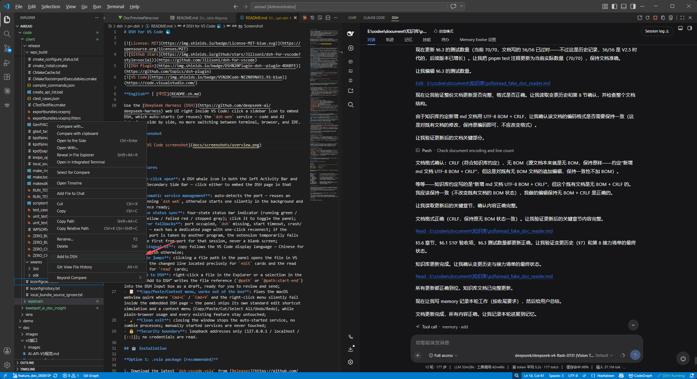
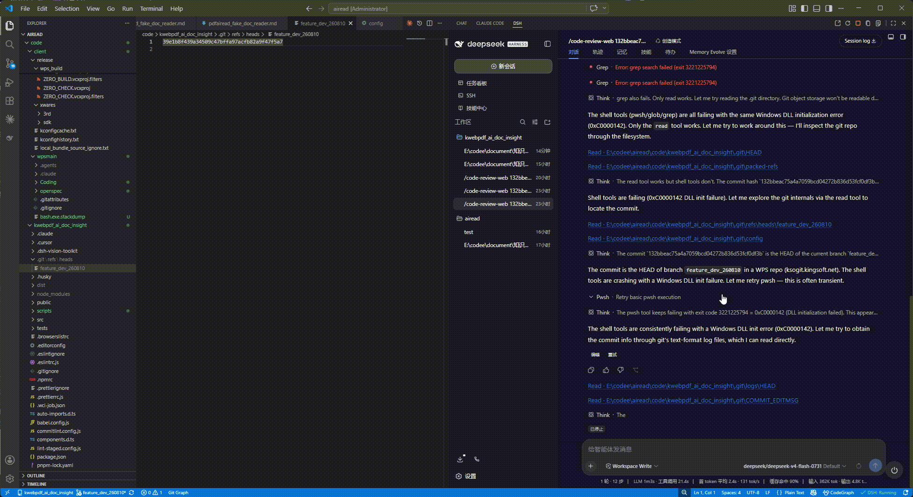

# DSH for VS Code 🐳

[](https://opensource.org/licenses/MIT)
[](https://github.com/Jillson1/dsh-for-vscode)
[](https://github.com/topics/dsh-plugin)
[](https://code.visualstudio.com/)

**中文** | [English](README.md)

在 VS Code 里把 [DeepSeek Harness（DSH）](https://github.com/deepseek-ai/deepseek-harness) **用成真正的 IDE 级 AI 编程**：不只是侧边栏内嵌一个网页，而是把「AI 改了哪些文件、改在哪、能不能撤」和「DSH 需要你决策的那一刻」都搬进编辑器，代码与 AI 同屏，不用切窗口、不用切浏览器。

> 一句话：**DSH 负责改，VS Code 负责让你看得见、审得了、随时撤得回。**

## 📸 界面截图





## 🎬 演示视频

[](https://www.bilibili.com/video/BV1p8bD6dE18)

*B 站 59 秒演示视频：[BV1p8bD6dE18](https://www.bilibili.com/video/BV1p8bD6dE18)*

---

## ✨ 特性总览

| 组 | 能力 | 一句话 |
|---|---|---|
| 🧭 基础 | 面板与文件联动 | 侧边栏内嵌 DSH；点文件路径直接跳转、`edit` 精确到修改行 |
| 📝 变更可视化 | 编辑区三色高亮 + hover 处置 | 改到哪、改成什么、怎么撤，全在编辑区里 |
| 🗂️ 可审阅的变更集 | 变更账本 / 变更导航 / 变更树 / 批量处置 / 行内按钮 | 变更成为持久对象：Reload 不失忆，一处一处过审 |
| 🎛️ 编辑器即前端 | 审批闸门 / 状态栏状态机 / 提问与计划审阅 | DSH 要你决策时，就在 VS Code 里答 |
| ⏪ 跨轮次可撤销 | 检查点 + 原生 diff + 一键恢复 | 回到「某一轮之前」，只回滚代码 |
| ⚡ 就地改代码 | 选区工具条 + Quick Edit | 选几行、写一句指令、回车即发 |
| ⚙️ 可控 | 每一项都能在设置里关掉 | 默认全开；不满意的功能一键静默，改完立即生效 |

## ✨ 特性详情

### 🧭 面板与文件联动

- 🖱️ **一键打开**：左侧活动栏与右侧辅助侧边栏各一个 DSH 鲸鱼图标，点击即在对应侧栏内嵌显示 DSH 网页，代码与 AI 同屏；
- 🚀 **服务自动管理**：自动探测端口——已有 `dsh web` 直接复用，没有则后台静默启动，就绪后自动加载；
- 🔄 **状态实时同步**：状态栏显示服务状态（运行中绿 / 启动中黄 / 失败红 / 已停止灰），点击即可开关面板；
- 🛟 **异常兜底**：端口被占、`dsh` 未安装、启动超时、服务崩溃/失联均有提示与一键重连，绝不白屏；端口冲突时自动改用空闲端口（仅本次会话）；
- 📂 **文件跳转**：点击面板里的文件路径直接在 VS Code 打开——`edit` 卡片**精确跳转到修改起始行**、`read` 卡片定位读取行，并**只跳行**（不会冒出多余的输入框或评论）；
- ➕ **添加到 DSH**：文件树 / 编辑器右键「添加到 DSH」，或选中代码按 <kbd>Alt</kbd>+<kbd>D</kbd>，把 `@路径` 或 `@路径:起始-结束` 写入输入框草稿，**审阅后手动发送**；
- 📋 **复制/粘贴/右键开箱即用**：修复 VS Code 内嵌环境下（尤其 macOS）聊天内容无法 <kbd>Cmd</kbd>+<kbd>C</kbd> 复制、粘贴、右键无菜单的问题；普通浏览器打开时行为完全不受影响；
- 🧹 **退出清理**：关闭最后一个窗口时停止插件自启的服务，不留僵尸进程；手动启动的服务永不干预；
- 🔒 **安全边界**：只连接回环地址（`127.0.0.1` / `localhost` / `[::1]`），不读取凭据。

### 📝 变更可视化：AI 改了什么，一眼看见

只要 DSH 通过 `edit` / `write` 改了文件，编辑区会立刻出现：

- 🟢 **新增行绿色**、🔴 **删除行红色**（以删除接缝边线表示，不涂脏存活行）、🟡 **替换琥珀色**，右侧 overview ruler 同步标记；
- ↩️ 行尾注入 `⇠ 原: …` 提示，直接看到被替换/删除的原文；
- 🖱️ **鼠标停在变更行** → hover 面板：`DSH 修改｜新增｜删除` + 增删统计 + diff 预览 + 「丢弃 / 保留 / 查看对比」按钮（同一行多条记录自动聚合成一个 hover）；
- 🛡️ **安全丢弃**：改前内容已找不到（你自己又改过）会弹确认；`write` 新建的文件「丢弃」= 删除该文件；纯追加内容只摘除 DSH 写的那部分，**绝不误伤你的手写代码**；
- 🧽 记录错位时的兜底：命令 `DSH: 清除当前文件标记（保留改动）`。

### 🗂️ 可审阅的变更集：Reload 不失忆，一处一处过审

- 💾 **变更账本（ChangeBook）**：变更成为**持久对象**（存于工作区状态），`Developer: Reload Window`、重开会话、切换会话后**记录与高亮仍在**，随时可撤；同一处改动不会被记两次；你手改过的文件标记为 stale（置灰 + 提示"文件已被外部修改"）而**不会被误删**；
- 🧭 **变更导航**：<kbd>F8</kbd> / <kbd>Shift</kbd>+<kbd>F8</kbd> 在当前文件内逐处游走，状态栏显示 `DSH 变更 1/3`（点它等同按 F8），到末尾自动环绕；
  - ⚠️ **不破坏 VS Code 原有习惯**：只有「当前文件确实有 DSH 变更」时 <kbd>F8</kbd> 才接管，否则仍是 VS Code 原本的"下一个问题"；
- 🗂️ **`DSH 变更` 侧边栏树**：`会话 → 文件 → 变更` 三层（会话节点显示「N 文件 · M 处变更」），点击跳转，节点右键可**保留 / 丢弃**；
- 🧨 **批量处置**：支持单条、**文件**、**会话**三种粒度，树里可 <kbd>Ctrl</kbd> 多选后右键一次处理；结果提示带**失败原因分布**（如 `成功 7，失败 2（原内容已找不到（文件被改过） ×2）`），失败的条目留在树里标红，便于重试；
- 🏷️ **行内 CodeLens**：变更行上方常驻 `✅ 保留 / ❌ 丢弃 / 🔍 对比` 三个可点按钮，不必 hover；同一行多处改动只出一组（标注 `（2 处）`）；定位不到的记录**不显示按钮**（不做"这里改过"的错误暗示）。

### 🎛️ 编辑器即前端：要你决策时，就在 VS Code 答

- 🛂 **审批闸门**：DSH 因权限受限要执行越界操作时，VS Code 直接弹**模态框**「允许一次 / 拒绝」，不用切回面板；
  - 🔐 只有这两种结果（DSH 载荷本身不支持"总是允许"，所以**不做无法兑现的承诺**）；按 <kbd>Esc</kbd> 关闭 = **不代答**，DSH 仍等待你在面板回答；
  - 🚫 凭据/密钥类请求（工具名含 credential / secret / api-key / token / password / env）**不在 IDE 代答**，提示回 DSH 面板处理；
- 📊 **agent 状态栏**：独立于"服务状态"的第二个状态项——`$(sync~spin) DSH · 运行中 · 第 N 轮` / `$(bell) DSH · 等待审批` / `$(check) DSH · 空闲`；
- 🔔 **完成通知**：一轮跑完**且本轮确实改了文件**时提示 `DSH 第 3 轮完成：4 个文件被修改`，点「查看」直接聚焦变更树；空轮次不打扰；
- ❓ **提问与计划审阅**：DSH 提问时在 IDE 呈现——有选项走 QuickPick（可多选）、需自由输入走 InputBox；`plan-review` 先把计划渲染成**只读 Markdown 文档**，再让你「批准 / 打回」（打回可附理由）；多个问题**一次答完、整批回传**，中途取消则整批不作答；
- 🧠 **不重复打扰**：默认「面板可见时把审批/提问交给面板」（设置 `dsh.interaction.onlyWhenPanelHidden`）——面板就在眼前时不会在 IDE 再问一遍。

### ⏪ 跨轮次可撤销：回到某一轮之前

- 🕐 **`DSH 检查点` 视图**：只读 DSH 的 `change-ledger`，按轮次列出检查点（「第 N 轮 · 时间 · N 文件」）；展开可见该轮之后被改动 / 删除的文件；
- 🔍 **原生 diff**：点击条目打开 VS Code 原生 diff 编辑器（该轮快照 ↔ 现在）；
- ⏪ **一键恢复**：右键「恢复到该轮之前（只回滚代码）」→ **先预览**受影响文件清单 → 模态确认 → 应用，完成后提示 `已恢复 N 个文件到该轮之前`；
- 🧯 **如实降级**：只支持**常规 git 工作区**（非 git 工作区显示"当前工作区无检查点"）；有其他活跃会话占用同一工作区时明确提示 `WORKSPACE_IN_USE`，**不绕过**；破坏性动作**不自动重试**。

### ⚡ 就地改代码：选区工具条 + Quick Edit

- 🎯 **选区工具条**：划选代码后，选区首行上方出现 `添加选区到 DSH` / `⚡ Quick Edit` 两个按钮；同时编辑器内提供评论线程式输入框；
- 📝 **Add to DSH**：把 `@文件:起始-结束` 写进输入框草稿（**不发送**），你补完描述再自己发；
- ⚡ **Quick Edit**：在输入框写一句「改成防抖」，点「发送到 DSH」或按 <kbd>Alt</kbd>+<kbd>K</kbd> 输入后回车，即自动发送 `@文件:12-14 改成防抖` 给 DSH 执行；
  - 🛑 首次发送前弹确认框（含将发送的全文），可勾「发送并不再询问」；空指令不发，**不替你消耗模型调用**；
  - ⏸️ DSH 正在跑一轮时，指令只写入草稿并提示「DSH 正在运行」，**不抢占、不丢输入**；
- 🕊️ **绝不打扰你**：只响应用户自己的选区（程序化跳行不会冒出线程）、不移动光标、不抢焦点，零长度或纯空白选区不触发。

### ⚙️ 可控：每一项都能关掉

v1.2 引入的每个功能都能在设置里单独开关，**默认全开**，**改完立即生效、无需重载窗口**（详见 [设置](#️-设置dsh)）。

## 📥 安装

**方式一：下载 .vsix 安装包（推荐）**

1. 前往 [Releases](https://github.com/Jillson1/dsh-for-vscode/releases) 下载最新 `dsh-for-vscode-*.vsix`；
2. VS Code 中按 `Ctrl+Shift+P` → 执行 `Extensions: Install from VSIX...` → 选择下载的文件；
3. 重载窗口（`Developer: Reload Window`）。

**方式二：从源码构建**

```bash
git clone https://github.com/Jillson1/dsh-for-vscode.git
cd dsh-for-vscode
npm install
npm run package        # 产出 dsh-vscode.vsix，再按方式一安装
```

**前置要求**：已安装 [DeepSeek Harness](https://github.com/deepseek-ai/deepseek-harness) 的 `dsh` 命令并位于 PATH 中（插件会自动检测；未安装时给出提示）。

> 💡 变更集、审批闸门、提问、检查点、Quick Edit 需要 DSH 侧同时安装配套插件 **`@jillson1/dsh-file-jump`**（提供回放、上行转发与同源恢复调用）。只装扩展不装插件时，这部分功能会表现成"没做完"。

## 🚀 使用

1. 安装后，**左侧活动栏**与**右侧辅助侧边栏**各出现一个 DSH 鲸鱼图标；
2. 点击任意一个图标：插件自动启动（或复用）`dsh web` 并内嵌显示 DSH 网页；
   - 点**右侧**图标 → 面板开在右侧，左侧文件目录不受影响；
   - 若 `dsh.port` 被其他程序占用，自动改用第一个空闲端口（仅本次会话临时生效，设置不变，弹窗告知）；
3. 面板标题栏按钮：`在浏览器中打开` `重启服务` `停止服务` `复制网址` `查看日志`；
4. 底部状态栏显示服务状态与 agent 状态，点击可开关面板；
5. **让 DSH 改几个文件**，然后：按 <kbd>F8</kbd> 逐处过审 → 在编辑区 hover 或点行内按钮处置 → 打开活动栏的 `DSH 变更` 树看全局 → 需要整体回退时用 `DSH 检查点`。

### 典型工作流

| 你想做的事 | 怎么做 |
|---|---|
| 看 AI 具体改了什么 | 编辑区三色高亮 + hover diff 预览，或 `DSH: 查看修改对比` 打开 diff 编辑器 |
| 一处一处审阅 | <kbd>F8</kbd> / <kbd>Shift</kbd>+<kbd>F8</kbd>（状态栏显示进度），或点行内 `保留 / 丢弃 / 对比` |
| 撤销某一处 | hover 里点「丢弃」，或在 `DSH 变更` 树里右键该节点 |
| 撤销一个文件/整个会话的改动 | 树里右键**文件节点**或**会话节点**（支持 <kbd>Ctrl</kbd> 多选） |
| 回到好几轮之前的状态 | `DSH 检查点` 视图 → 右键检查点 → 恢复到该轮之前 |
| 让 DSH 改我选的这段代码 | 划选 → 点「⚡ Quick Edit」或按 <kbd>Alt</kbd>+<kbd>K</kbd> → 写指令发送 |
| 把这段代码引用给 DSH 讨论 | 划选 → <kbd>Alt</kbd>+<kbd>D</kbd>（只写草稿，不发送） |
| 批准 DSH 的越界操作 | VS Code 弹出的模态框里选「允许一次 / 拒绝」 |
| 只想安静用基础功能 | 设置里关掉 `dsh.ideInteraction.enabled` 或 `dsh.changes.enabled` 等开关 |

## ⌨️ 快捷键与右键菜单

| 操作 | 默认键位 | 生效条件 |
|---|---|---|
| 跳到下一处变更 | <kbd>F8</kbd> | 当前文件确有 DSH 变更**且**变更集开关打开（否则交给 VS Code 原本行为） |
| 跳到上一处变更 | <kbd>Shift</kbd>+<kbd>F8</kbd> | 同上 |
| 将选区添加到 DSH | <kbd>Alt</kbd>+<kbd>D</kbd> | 编辑器有选区 |
| 用指令改这段代码（Quick Edit） | <kbd>Alt</kbd>+<kbd>K</kbd> | 编辑器有选区 |

右键菜单入口：文件树 / 编辑器标签（`添加到 DSH`）、编辑器（`添加到 DSH`、`用指令改这段代码`）、`DSH 变更` 树节点（保留/丢弃/批量）、`DSH 检查点` 节点（对比/恢复）、评论线程标题（`Add to DSH` / `Quick Edit`）。

## 🧰 命令面板（`DSH:` 开头）

**面板与服务**

| 命令 | 说明 |
|---|---|
| `DSH: 打开面板` | 打开左侧面板 |
| `DSH: 在辅助侧边栏打开` | 打开右侧面板 |
| `DSH: 在浏览器中打开` | 在系统浏览器打开 DSH 页面 |
| `DSH: 重启服务` / `DSH: 停止服务` | 重启 / 停止插件管理的服务 |
| `DSH: 复制网址` | 复制 DSH 页面地址 |
| `DSH: 查看日志` / `DSH: 复制日志` | 打开日志输出通道 / 复制完整日志（含环境信息，用于反馈） |
| `DSH: 重试桥接安装` / `DSH: 卸载桥接` | 重装桥接 / 移除桥接并还原 `cordis.patch.yml` |

**添加到 DSH**

| 命令 | 说明 |
|---|---|
| `DSH: 添加到 DSH` | 写入 `@路径` 草稿 |
| `DSH: 将选区添加到 DSH（Alt+D）` | 写入 `@路径:起始-结束` 草稿 |

**变更可视化与处置**

| 命令 | 说明 |
|---|---|
| `DSH: 查看修改对比` | 打开改动前后的 diff 编辑器 |
| `DSH: 撤销最近一处修改` / `DSH: 保留最近一处修改` | 处置当前文件最近一处改动 |
| `DSH: 撤销当前文件全部修改` / `DSH: 保留当前文件全部修改` | 当前文件整体处置 |
| `DSH: 清除当前文件标记（保留改动）` | 只清标记，文件不动（记录错位时的兜底） |

**变更集（F1–F5）**

| 命令 | 说明 |
|---|---|
| `DSH: 跳到下一处变更` / `DSH: 跳到上一处变更` | 等同 <kbd>F8</kbd> / <kbd>Shift</kbd>+<kbd>F8</kbd> |
| `打开并定位` / `保留这处修改` / `丢弃这处修改` | 变更节点操作（树右键或行内按钮） |
| `保留本文件全部修改` / `丢弃本文件全部修改` | 文件粒度批量 |
| `保留本会话全部修改` / `丢弃本会话全部修改` | 会话粒度批量 |
| `刷新变更列表` | 手动刷新 `DSH 变更` 树 |

**检查点（F9）**

| 命令 | 说明 |
|---|---|
| `刷新检查点` | 重新读取账本 |
| `对比该轮之前` | 快照 ↔ 当前文件的原生 diff |
| `恢复到该轮之前（只回滚代码）` | 预览 → 确认 → 应用 |

**选区与 Quick Edit（F10/F11）**

| 命令 | 说明 |
|---|---|
| `DSH: 用指令改这段代码（Alt+K）` | 弹输入框，回车即发 |
| `Quick Edit 这段代码` | 线程标题按钮：展开编辑器内输入框 |
| `把选区加入 DSH` | 线程标题按钮：写草稿不发送 |
| `发送到 DSH` | 线程输入框按钮：把指令发给 DSH |

## 🔗 桥接与联动

安装后，插件会在你的 DSH 用户目录安装桥接包（经 DSH 官方客户端插件扩展点安装），让面板与 VS Code 双向联动：

- 🔗 **外链跳转**：面板内点击外链，在系统默认浏览器中打开（而非被困在 iframe 内）；
- 📂 **文件跳转**：点击面板内文件路径，在 VS Code 打开并定位；
- 📋 **剪贴板复制**：面板内 DSH 的复制按钮改由扩展宿主写入系统剪贴板，绕开 VS Code 对 webview 内跨源 iframe 的剪贴板权限拦截；
- 🔄 **双向消息（交互增强）**：变更回放与归因、会话状态（运行中/轮次/待决数）、审批请求、提问请求**上行**；审批结论、提问回答、Quick Edit 指令与检查点恢复调用**下行**。

握手成功后日志会打印能力表：

```
[bridge] handshake ok capabilities=[openFile,diffApplied,injectComposer,quickEdit,approval,question,changes,checkpoint,sessionState]
```

### 安装与卸载机制（透明披露）

1. 在你的 DSH 用户目录（`$DSH_HOME/profiles/web`，默认 `~/.dsh/profiles/web`）安装桥接包 `dsh-vscode-bridge`（**扩展自带对应版本**，激活时按版本比对自动重装）；
2. 在 `cordis.patch.yml` 中写入一段带 `# dsh-vscode-bridge: begin` / `# dsh-vscode-bridge: end` 标记的 `insert:` 条目，把桥接包注册为 DSH 的官方 client 插件（**只写用户目录，绝不触碰 DSH 安装目录**）。

如需移除：执行 `DSH: 卸载桥接`，按标记精确删除写入条目并删除桥接目录，还原 `cordis.patch.yml` 原文件（你原有的内容不受影响）。

### 降级行为

桥接仅在面板内生效。若未生效（例如你在浏览器里单独打开 DSH 页面、或安装失败），**面板完全可用**，仅上述联动不可用；插件启动时弹一次警告，可选择「重试安装」或「不再提示」。交互增强类功能（审批、提问、检查点、Quick Edit、变更回放）依赖桥接，未生效时会静默缺席。

## ⚙️ 设置（`dsh.*`）

> 所有开关**默认开启**，改完**立即生效**（无需重载窗口）。

### 功能总开关（v1.2 交互增强）

| 设置项 | 默认 | 关闭后 |
|---|---|---|
| `dsh.changes.enabled` | `true` | 不再记录改动（连文件都不读）、不出三色高亮与行内按钮、`DSH 变更` 树为空、<kbd>F8</kbd> 交还 VS Code；**并清空已有标记与账本**（提示：这是唯一会丢历史记录的开关） |
| `dsh.checkpoints.enabled` | `true` | 完全不读 `~/.dsh/change-ledger`（省 I/O），检查点视图为空，恢复类命令只提示不请求 |
| `dsh.ideInteraction.enabled` | `true` | IDE 不弹审批框 / 提问框 / 完成通知，选中文本不出现工具条与输入框；审批与提问**交回 DSH 面板**应答 |
| `dsh.quickEdit.enabled` | `true` | <kbd>Alt</kbd>+<kbd>K</kbd>、右键「用指令改这段代码」、线程发送都提示已关闭，**绝不发送指令** |
| `dsh.statusbar.agent.enabled` | `true` | 只隐藏 agent 状态栏项（不影响"服务状态"项与完成通知） |

### 细分开关与行为

| 设置项 | 默认 | 说明 |
|---|---|---|
| `dsh.selection.lens.enabled` | `true` | 选区首行上方的工具条按钮（关掉后仍可用右键菜单与快捷键） |
| `dsh.selection.threads.enabled` | `true` | 编辑器内评论线程输入框（关掉后 Quick Edit 退化为 Alt+K 输入框） |
| `dsh.quickEdit.confirmBeforeSend` | `true` | Quick Edit 发送前确认（会真实消耗一轮模型调用）；勾过"不再询问"会自动置 false |
| `dsh.notify.onTurnComplete` | `true` | 轮次完成通知（仅当本轮确实改了文件） |
| `dsh.interaction.onlyWhenPanelHidden` | `true` | 面板可见时把审批/提问交给面板，不在 IDE 再问一遍 |

### 服务与桥接

| 设置项 | 默认 | 说明 |
|---|---|---|
| `dsh.port` | `3080` | 期望端口（探测与启动共用） |
| `dsh.host` | `127.0.0.1` | 服务地址（仅允许回环地址） |
| `dsh.autoStart` | `true` | 服务未运行时自动启动 |
| `dsh.stopOnExit` | `true` | 关闭最后一个窗口时停止插件自启的服务 |
| `dsh.extraArgs` | `[]` | 启动 `dsh web` 时附加的参数 |
| `dsh.executablePath` | `""` | `dsh` 可执行文件绝对路径（Windows 为 `dsh.cmd`）；留空从 PATH 查找 |
| `dsh.workspaceRootIndex` | `0` | 多根工作区时用第几个根目录作为 `dsh web` 的工作目录 |
| `dsh.bridge.enabled` | `true` | 是否启用桥接（关闭后上表所有联动不可用） |
| `dsh.bridge.silenceWarning` | `false` | 抑制桥接降级警告 |

## 🌍 多语言

界面文案跟随 VS Code 显示语言（`Configure Display Language`）：`zh-*` → 简体中文，其余语言 → 英文。设置项描述同样双语（`package.nls.json` / `package.nls.zh-cn.json`）。

## 🧑‍💻 开发

环境要求：Node.js ≥ 22、VS Code ≥ 1.91。

```bash
npm install
npm run test          # 400 个单元/集成测试（含真实 dsh web 全流程）
npm run compile       # 构建 out/extension.js
npm run watch         # 监听构建
npm run typecheck     # 类型检查
npm run package       # 打包 .vsix
```

调试：VS Code 打开本目录，按 `F5` 启动 Extension Development Host。

```
src/
├── extension.ts           # 入口：装配、命令注册、设置生效分发
├── config.ts              # 设置读取与规范化（含功能开关）
├── i18n.ts                # 动态文案字典（zh-* 中文 / 其余英文）
├── statusbar.ts           # 服务状态项 + agent 状态项（F7）
├── bridge/                # 桥接安装器、握手宿主、消息处理、修改执行器
│   ├── diff-service.ts    # 三色高亮 / 撤销 / hover / diff 视图
│   ├── diff-tracker.ts    # 定位与撤销编辑构造（纯逻辑）
│   ├── change-book.ts     # F1 变更账本（持久化 + stale 判定）
│   ├── approval-router.ts # F6 审批闸门（安全边界）
│   ├── question-router.ts # F8 提问 / plan-review
│   └── agent-state.ts     # F7 状态机
├── changes/               # F2 导航 / F3 树 / F4 批量 / F5 CodeLens
├── checkpoints/           # F9 账本读取、blob diff、恢复编排
├── selection/             # F10 工具条与线程 / F11 Quick Edit
├── service/               # 端口探测、子进程封装、服务管理器
└── panel/                 # WebviewViewProvider 与占位页模板
```

## 🧭 已知限制

- **检查点只支持常规 git 工作区**（引擎限制）：非 git 工作区、sparse checkout、submodule 都不会产生检查点；
- **恢复动作依赖 DSH 侧插件**：未安装 `@jillson1/dsh-file-jump` 时，检查点视图仍可列历史，但"恢复"会提示不可用；
- **声音提醒未实现**：VS Code 扩展 API 无声音能力，因此没有"完成时响一声"这个设置项（宁可不做，也不留死开关）；
- **选区输入框宽度不可控**：评论线程是 VS Code 原生控件，宽度不由扩展决定；本插件的妥协是"默认收起 + 正文用紧凑摘要"；
- **变更集开关会清空历史**：`dsh.changes.enabled` 关闭时账本与标记一起清除（为保证状态一致），重新打开不会恢复历史；
- 欢迎页"DSH 入门"卡片的彩色图标来自 Marketplace 画廊数据，仅在商店上架后显示；
- VS Code 平台规则：左侧图标打开左侧面板、右侧图标打开右侧面板，无法交叉。

## 🌐 社区

本项目是 DeepSeek Harness 社区插件（话题：[`dsh-plugin`](https://github.com/topics/dsh-plugin)）。

- DSH 官方仓库：<https://github.com/deepseek-ai/deepseek-harness>
- 配套 DSH 插件：<https://github.com/Jillson1/dsh-file-jump>
- 问题反馈：<https://github.com/Jillson1/dsh-for-vscode/issues>
- DSH 社区讨论：<https://github.com/deepseek-ai/deepseek-harness/discussions>

## 📄 License

[MIT](./LICENSE) © 2026 liufuchen
